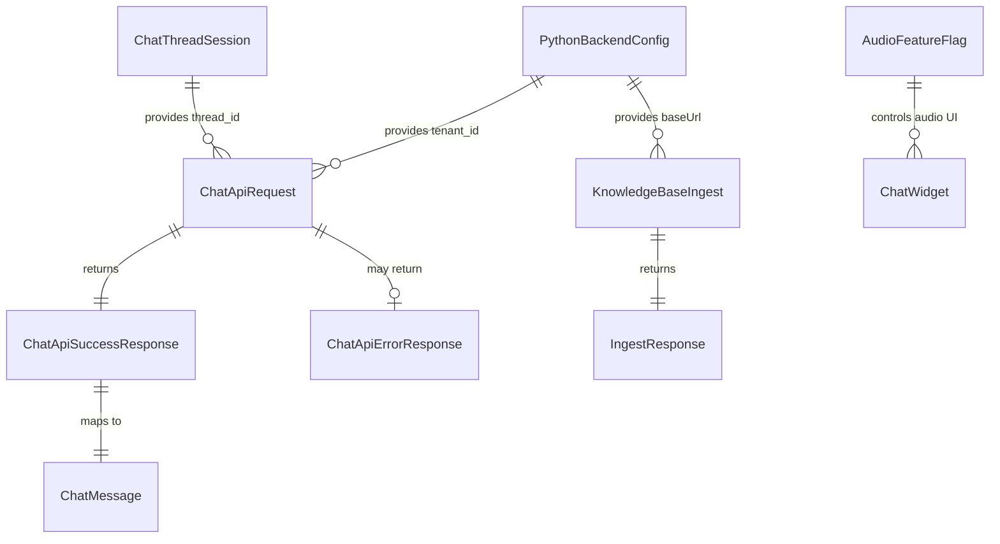
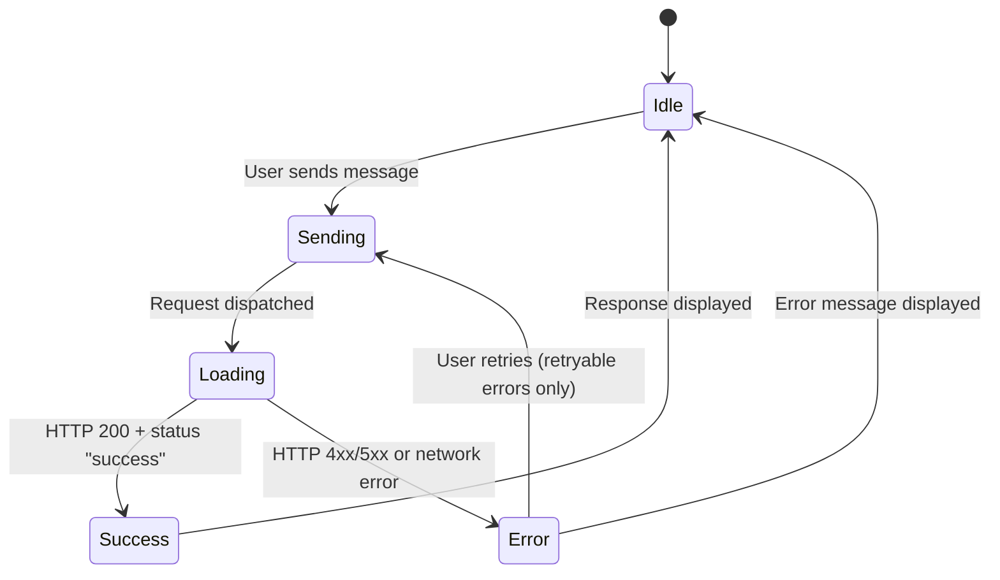

# Data Model: Integração com Backend Python de Agendamento IA

**Date**: 2026-08-06
**Feature**: specs/010-integrate-python-backend

## Entities

### 1. PythonBackendConfig

Configuração de conexão com o backend Python. Fonte: variáveis de ambiente (`.env`).

| Field | Type | Required | Description |
|-------|------|----------|-------------|
| `baseUrl` | `string` | Yes | URL base do backend Python (ex: `http://localhost:8000`) |
| `tenantId` | `string` | Yes | Identificador do tenant/cliente (ex: `987654`) |

**Source**: `NEXT_PUBLIC_PYTHON_BACKEND_URL`, `NEXT_PUBLIC_TENANT_ID`

**Validation Rules**:
- `baseUrl`: non-empty string, must be a valid URL (no trailing slash in storage, appended at request time)
- `tenantId`: non-empty string

**Lifecycle**: Read at build time, available at runtime via `process.env`. Immutable per deploy.

---

### 2. ChatThreadSession

Sessão de conversa do visitante. Representa a continuidade de contexto entre mensagens.

| Field | Type | Required | Description |
|-------|------|----------|-------------|
| `threadId` | `string` (UUID v4) | Yes | Identificador único da sessão de conversa |

**Source**: `crypto.randomUUID()` na primeira visita; `localStorage.getItem("chat_thread_id")` em visitas subsequentes.

**Persistence**: `localStorage` key `chat_thread_id`. Fallback: `Map<string, string>` em memória quando localStorage indisponível.

**Validation Rules**:
- `threadId`: must match UUID v4 format (`xxxxxxxx-xxxx-4xxx-yxxx-xxxxxxxxxxxx`)
- On corruption/unparseable value → regenerate new UUID

**State Transitions**:
```
[No thread_id] --(first visit)--> [UUID generated & persisted]
[Has thread_id in localStorage] --(return visit)--> [UUID loaded from localStorage]
[localStorage unavailable] --(any visit)--> [UUID in memory only]
[thread_id rejected by backend] --(error response)--> [UUID regenerated]
```

---

### 3. ChatApiRequest

Requisição enviada ao endpoint de chat do backend Python.

| Field | Type | Required | Description |
|-------|------|----------|-------------|
| `message` | `string` | Yes | Texto da mensagem do usuário (trimmed) |
| `thread_id` | `string` (UUID v4) | Yes | Identificador da sessão de conversa |

**Headers**:
| Header | Value | Required |
|--------|-------|----------|
| `X-Tenant-ID` | `PythonBackendConfig.tenantId` | Yes |
| `Content-Type` | `application/json` | Yes |

**Validation Rules**:
- `message`: max 4000 characters (FR herdado do spec 008); non-empty after trim
- `thread_id`: non-empty string, UUID v4 format

**Endpoint**: `POST {PythonBackendConfig.baseUrl}/api/v1/chat`

---

### 4. ChatApiSuccessResponse

Resposta de sucesso do endpoint de chat.

| Field | Type | Description |
|-------|------|-------------|
| `tenant_id` | `string` | Tenant que processou a requisição |
| `status` | `"success"` | Indicador de sucesso |
| `response` | `string` | Texto da resposta da IA |

**Mapping to ChatMessage**:
```
ChatMessage {
  id: `${Date.now()}-ai`,
  role: "ai",
  content: response.response,
  timestamp: Date.now()
}
```

**Fallback**: Se `response` estiver ausente ou vazio → `"Recebemos sua mensagem e já estamos processando."`

---

### 5. ChatApiErrorResponse

Resposta de erro do endpoint de chat.

| HTTP Status | Body Field | Description |
|-------------|------------|-------------|
| 504 | `{ "detail": string }` | Gateway Timeout — IA demorou para responder |
| 500 | `{ "detail": string }` | Internal Server Error — erro no motor de IA |

**Mapping to UI**:

| HTTP Status | Error Message (User-facing) | Retryable |
|-------------|----------------------------|-----------|
| 504 | "O serviço de atendimento demorou para responder. Por favor, tente novamente em instantes." | Yes |
| 500 | "Erro interno no motor de IA. Nossa equipe foi notificada." | Yes |
| Network Error (fetch throws) | "Não foi possível se conectar ao serviço de mensagens." | Yes |
| Other 4xx | Extracted from response body or fallback | No |
| Other 5xx | Extracted from response body or fallback | Yes |

---

### 6. KnowledgeBaseIngest

Requisição de ingestão de regras de negócio no banco vetorial RAG.

| Field | Type | Required | Description |
|-------|------|----------|-------------|
| `text_content` | `string` | Yes | Texto institucional/regras de negócio do cliente |

**Headers**:
| Header | Value | Required |
|--------|-------|----------|
| `X-Tenant-ID` | Preenchido pelo admin no formulário (NÃO da env var) | Yes |
| `Content-Type` | `application/json` | Yes |

**Validation Rules**:
- `text_content`: non-empty after trim; max 100,000 characters (limite prático de textarea)
- `X-Tenant-ID`: non-empty string (validado no formulário)

**Endpoint**: `POST {PythonBackendConfig.baseUrl}/api/v1/ingest/text`

---

### 7. IngestResponse

Resposta do endpoint de ingestão.

| Field | Type | Description |
|-------|------|-------------|
| `tenant_id` | `string` | Tenant que recebeu o texto |
| `status` | `"processing"` | Status da tarefa de vetorização |
| `message` | `string` | Descrição do status |

**Mapping to UI Feedback**:

| Response | UI Message |
|----------|-----------|
| `201 Created` + `status: "processing"` | "Texto enviado para vetorização. O processamento está em andamento em segundo plano." |
| `4xx` / `5xx` | Mensagem de erro do corpo da resposta (ou fallback genérico) |

---

### 8. AudioFeatureFlag

Controle de disponibilidade da funcionalidade de áudio.

| Field | Type | Description |
|-------|------|-------------|
| `isAudioEnabled` | `boolean` | Se `true`, botão de microfone e gravação ficam disponíveis |

**Source**: `NEXT_PUBLIC_ENABLE_AUDIO` env var. Default: `false`.

**Impact**: Quando `false`:
- `ChatInput`: botão de microfone oculto
- `useChatAssistant`: funções `startRecording`/`stopRecording` não são chamadas pela UI (mas permanecem no hook)
- Código de áudio (`audioOptimization.ts`, `audioFromBase64.ts`) permanece intacto e importado

---

## Relationships



## State Diagram: Chat Message Flow


