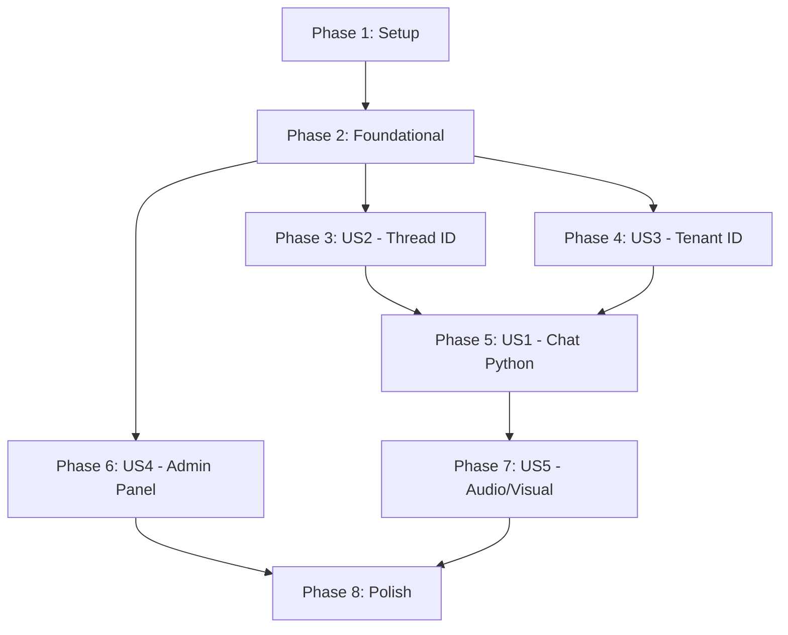

# Tasks: Integração com Backend Python de Agendamento IA

**Input**: Design documents from `/specs/010-integrate-python-backend/`
**Prerequisites**: plan.md (required), spec.md (required), research.md, data-model.md, contracts/

**Tests**: Included — exigidos pela Constituição do projeto (Principle IV: "No feature is 'Done' without automated test coverage") e pelo success criteria SC-002, SC-005, SC-006.

**Organization**: Tasks are grouped by user story to enable independent implementation and testing of each story.

## Format: `[ID] [P?] [Story] Description`

- **[P]**: Can run in parallel (different files, no dependencies)
- **[Story]**: Which user story this task belongs to (e.g., US1, US2, US3)
- Include exact file paths in descriptions

## Path Conventions

- All source under `src/` at repository root (Next.js App Router project)
- Components: `src/components/`, Hooks: `src/hooks/`, Services: `src/services/`
- Tests colocated with source files (`*.test.ts` / `*.test.tsx`)

---

## Phase 1: Setup (Shared Infrastructure)

**Purpose**: Environment configuration and contract type definitions — prerequisites for all implementation

- [x] T001 [P] Add environment variables `NEXT_PUBLIC_PYTHON_BACKEND_URL`, `NEXT_PUBLIC_TENANT_ID`, and `NEXT_PUBLIC_ENABLE_AUDIO` to `.env` file
- [x] T002 [P] Update `.env.example` (if exists) with the new variables and descriptions from quickstart.md
- [x] T003 [P] Create Python backend TypeScript types (`PythonChatRequest`, `PythonChatSuccessResponse`, `PythonChatErrorResponse`, `IngestRequest`, `IngestSuccessResponse`, `IngestErrorResponse`, `PythonBackendConfig`) in `src/services/pythonBackend.types.ts`

**Checkpoint**: Environment ready, types defined — foundational implementation can begin

---

## Phase 2: Foundational (Blocking Prerequisites)

**Purpose**: Core infrastructure that MUST be complete before ANY user story can be implemented — HTTP client, session management, and configuration utilities

**⚠️ CRITICAL**: No user story work can begin until this phase is complete

- [x] T004 [P] Implement `sessionManager.ts` with `getThreadId()` and `resetThreadId()` functions using `crypto.randomUUID()` and localStorage with in-memory fallback in `src/services/sessionManager.ts`
- [x] T005 [P] Implement `pythonBackend.ts` HTTP client with `sendChatMessage()` and `ingestKnowledge()` functions wrapping `fetch`, error classification (504→timeout, 500→internal, network→connection), and response normalization in `src/services/pythonBackend.ts`
- [x] T006 [P] Implement `getPythonBackendConfig()` function that reads and validates `NEXT_PUBLIC_PYTHON_BACKEND_URL` and `NEXT_PUBLIC_TENANT_ID` from environment, returning typed config or throwing descriptive error if missing, in `src/services/pythonBackend.ts`
- [x] T007 Update barrel export file `src/services/index.ts` to export all new modules (`pythonBackend`, `pythonBackend.types`, `sessionManager`) and new types
- [x] T008 Implement unit tests for `sessionManager.ts` covering: first-visit UUID generation, localStorage persistence and retrieval across simulated reloads, localStorage unavailable fallback (mock `Storage.prototype.setItem`/`getItem` to throw), and `resetThreadId()` generating new UUID, in `src/services/sessionManager.test.ts`
- [x] T009 Implement unit tests for `pythonBackend.ts` covering: successful `sendChatMessage()` with response parsing, HTTP 504 error with timeout message, HTTP 500 error with internal error message, network failure (fetch rejection), and `ingestKnowledge()` success (201) and error paths, in `src/services/pythonBackend.test.ts`

**Checkpoint**: Foundation ready — session manager, Python HTTP client, config validation, and their tests are all functional. User story implementation can now begin.

---

## Phase 3: User Story 2 - Gerenciamento de thread_id via localStorage (Priority: P1)

**Goal**: O sistema gera e persiste um UUID v4 (`thread_id`) no localStorage para cada visitante, garantindo continuidade de contexto entre mensagens e entre recargas de página. Fallback em memória quando localStorage indisponível.

**Independent Test**: Abrir o chat, verificar no localStorage que `chat_thread_id` existe como UUID v4, recarregar a página e confirmar que o mesmo valor é mantido. Em modo anônimo, verificar que o chat funciona sem persistência.

### Implementation for User Story 2

- [x] T010 [US2] Integrate `getThreadId()` from `sessionManager` into `useChatAssistant` hook — replace any hardcoded/dummy thread logic, ensuring thread_id is resolved at hook initialization and passed to every `sendMessage` call, in `src/hooks/useChatAssistant.ts`
- [x] T011 [US2] Add console.info log on thread_id initialization (first visit vs. restored) for observability, in `src/hooks/useChatAssistant.ts`
- [x] T012 [US2] Update `useChatAssistant.test.ts` to mock `sessionManager.getThreadId` and verify: thread_id is passed to the send function, thread_id persists across multiple sendMessage calls, and hook initializes cleanly when localStorage is mocked as unavailable, in `src/hooks/useChatAssistant.test.ts`

**Checkpoint**: thread_id generation, persistence, and fallback fully functional and tested

---

## Phase 4: User Story 3 - Configuração do X-Tenant-ID (Priority: P1)

**Goal**: Toda requisição ao backend Python inclui o header `X-Tenant-ID` com valor da variável de ambiente `NEXT_PUBLIC_TENANT_ID`. Se ausente, o sistema bloqueia o envio com mensagem de erro orientativa.

**Independent Test**: Configurar `NEXT_PUBLIC_TENANT_ID=123` no `.env`, enviar uma mensagem e verificar no log de rede que o header `X-Tenant-ID: 123` está presente. Remover a variável e verificar que o chat exibe erro de configuração.

### Implementation for User Story 3

- [x] T013 [US3] Add `X-Tenant-ID` header injection in `sendChatMessage()` function using config from `getPythonBackendConfig()`, in `src/services/pythonBackend.ts`
- [x] T014 [US3] Implement tenant ID validation guard in `useChatAssistant.sendMessage()` — before dispatching, call `getPythonBackendConfig()`, if it throws (missing tenant), set `audioError` state to a user-facing message like "Configuração do tenant ausente. Contate o administrador." and abort send, in `src/hooks/useChatAssistant.ts`
- [x] T015 [US3] Update `pythonBackend.test.ts` to verify `X-Tenant-ID` header is present with correct value on success and error requests, and that missing env var produces the expected validation error, in `src/services/pythonBackend.test.ts`

**Checkpoint**: Tenant ID header injection, validation, and error handling fully functional and tested

---

## Phase 5: User Story 1 - Visitante conversa com a IA via novo backend Python (Priority: P1) 🎯 MVP

**Goal**: O chat envia mensagens de texto para `POST /api/v1/chat` do backend Python (substituindo o BFF anterior), processa a resposta e exibe a mensagem da IA no widget de chat sem alteração visual. Erros 500/504 exibem mensagens amigáveis com opção de reenvio.

**Independent Test**: Abrir o widget, digitar "Olá, gostaria de agendar um corte de cabelo", verificar no console que a requisição foi para `http://localhost:8000/api/v1/chat` com `{ "message": "...", "thread_id": "<uuid>" }` e header `X-Tenant-ID`. A resposta da IA aparece como balão alinhado à esquerda. Simular backend offline e verificar mensagem de erro com opção de retry.

### Tests for User Story 1

> **NOTE: Write these tests FIRST, ensure they FAIL before implementation**

- [x] T016 [P] [US1] Add test scenario in `useChatAssistant.test.ts`: sends text message via new Python backend contract (`message` + `thread_id`, not `text`), in `src/hooks/useChatAssistant.test.ts`
- [x] T017 [P] [US1] Add test scenario in `useChatAssistant.test.ts`: processes success response (`{ status: "success", response: "..." }`) and appends AI message to conversation, in `src/hooks/useChatAssistant.test.ts`
- [x] T018 [P] [US1] Add test scenario in `useChatAssistant.test.ts`: handles HTTP 500 error with friendly message and allows retry via `retryLastMessage()`, in `src/hooks/useChatAssistant.test.ts`
- [x] T019 [P] [US1] Add test scenario in `useChatAssistant.test.ts`: handles HTTP 504 timeout with friendly message and allows retry, in `src/hooks/useChatAssistant.test.ts`

### Implementation for User Story 1

- [x] T020 [US1] Refactor `useChatAssistant.sendMessage()` to call `sendChatMessage()` from `pythonBackend.ts` instead of `sendTextMessageToBff()` — pass `message` text and `thread_id` from sessionManager; remove dependency on old BFF text function, in `src/hooks/useChatAssistant.ts`
- [x] T021 [US1] Refactor `useChatAssistant.handleGatewayResult()` to process `PythonChatSuccessResponse` — extract `response` field (not `reply`/`response_text`), map to `ChatMessage` with role `"ai"`, and log `correlationId` if present, in `src/hooks/useChatAssistant.ts`
- [x] T022 [US1] Implement error handling in `handleGatewayResult()` for Python backend errors: HTTP 504 → "O serviço de atendimento demorou para responder. Por favor, tente novamente em instantes.", HTTP 500 → "Erro interno no motor de IA. Nossa equipe foi notificada.", network error → "Não foi possível se conectar ao serviço de mensagens.", set `canRetry` accordingly, in `src/hooks/useChatAssistant.ts`
- [x] T023 [US1] Refactor `useChatAssistant.retryLastMessage()` to use `sendChatMessage()` instead of old BFF retry logic, preserving retry payload pattern, in `src/hooks/useChatAssistant.ts`
- [x] T024 [US1] Add observability logging: on every request, log `{ tenant_id, thread_id, endpoint: "/api/v1/chat" }` to console.info with label `[PythonBackend]`; on error, log `{ status, errorStatus, message }`, in `src/hooks/useChatAssistant.ts`
- [x] T025 [US1] Update `useChatAssistant.test.ts` mocks — mock `sendChatMessage` and `getThreadId` from new modules instead of `sendTextMessageToBff`; ensure all existing text-message scenarios pass with new contract; remove or update any tests tied to old `{ text }` body format, in `src/hooks/useChatAssistant.test.ts`
- [x] T026 [US1] Verify that `ChatContext.tsx`, `ChatWidget.tsx`, `ChatMessages.tsx`, and `ChatStatus.tsx` require NO changes — run existing component tests and confirm all pass without modification, in `src/context/ChatContext.tsx`, `src/components/chat/`

**Checkpoint**: Chat fully functional with Python backend — send, receive, error handling, retry, logging all working. US1 is the MVP delivery point.

---

## Phase 6: User Story 4 - Painel Administrador para Ingestão de Regras de Negócio (Priority: P2)

**Goal**: Nova página `/admin` com formulário para enviar texto institucional ao endpoint `POST /api/v1/ingest/text`. Feedback visual de loading/sucesso/erro. Sem autenticação na v1.

**Independent Test**: Acessar `http://localhost:3000/admin`, preencher Tenant ID (`987654`) e texto institucional, clicar "Salvar e Vetorizar Base de Conhecimento", verificar que o backend retorna 201 e mensagem de sucesso aparece.

### Tests for User Story 4

- [x] T027 [P] [US4] Implement unit tests for `useAdminIngest` hook covering: successful ingest (201 + status "processing"), HTTP 400 error, HTTP 500 error, network failure, and empty text_content validation, in `src/hooks/useAdminIngest.test.ts`

### Implementation for User Story 4

- [x] T028 [P] [US4] Create `useAdminIngest` hook with state: `tenantId`, `textContent`, `isLoading`, `result` (success/error message), and action `submitIngest()` that calls `ingestKnowledge()` from `pythonBackend.ts`, in `src/hooks/useAdminIngest.ts`
- [x] T029 [P] [US4] Create `IngestForm` component — dumb component that renders: Tenant ID text input, textarea for content (min 5 rows, max 100k chars), submit button "Salvar e Vetorizar Base de Conhecimento" with loading state (spinner + disabled), and success/error message display area. Follow glassmorphism design (reuse existing theme tokens, `backdrop-blur`, `GlowButton` pattern if one exists), in `src/components/admin/IngestForm.tsx`
- [x] T030 [US4] Create `/admin` page as Client Component (`"use client"`) — export Metadata with title "Painel Administrador | Interasis AI", render `<main>` with semantic structure (`<h1>`, `<section>`), consume `useAdminIngest` hook and pass props to `IngestForm`, in `src/app/admin/page.tsx`
- [x] T031 [US4] Add `X-Tenant-ID` header injection in `ingestKnowledge()` function using the tenant ID passed from the admin form input (NOT from env var `NEXT_PUBLIC_TENANT_ID`), in `src/services/pythonBackend.ts`
- [x] T032 [US4] Add error handling in `IngestForm`: display `detail` field from error response, allow form correction and resubmission (do not clear form on error), in `src/components/admin/IngestForm.tsx`
- [x] T033 [US4] Add success feedback in `IngestForm`: on 201 response, show "Texto enviado para vetorização. O processamento está em andamento em segundo plano." with checkmark icon from lucide-react, clear textarea but keep tenant ID, in `src/components/admin/IngestForm.tsx`

**Checkpoint**: Admin panel fully functional — ingest form with loading, success, and error states. Page accessible at `/admin`.

---

## Phase 7: User Story 5 - Preservação da Experiência Visual e Desabilitação de Áudio (Priority: P2)

**Goal**: O widget de chat mantém 100% da aparência e comportamento existente (glassmorphism, animações, responsividade, scroll, indicador de carregamento). Botão de microfone e gravação de áudio são desabilitados via feature flag `NEXT_PUBLIC_ENABLE_AUDIO=false`. Código de áudio permanece intacto.

**Independent Test**: Percorrer todos os acceptance scenarios do spec 005 (chatbot-ui-ux) e verificar que passam. Confirmar que o botão de microfone NÃO está visível no `ChatInput`. Verificar que `audioOptimization.ts` e `audioFromBase64.ts` permanecem no código sem erros de compilação.

### Tests for User Story 5

[x] - [ ] T034 [P] [US5] Add test in `useChatAssistant.test.ts`: when `NEXT_PUBLIC_ENABLE_AUDIO` is `"false"`, `isRecording` remains `false` and audio-related functions are not exposed (or return early), in `src/hooks/useChatAssistant.test.ts`
[x] - [ ] T035 [P] [US5] Run full existing test suite (`npm test`) and verify zero regressions — all tests from specs 005, 006, 007, 008 that were passing before must still pass, in `src/` (global)

### Implementation for User Story 5

[x] - [ ] T036 [P] [US5] Add audio feature flag check in `ChatInput.tsx` — read `NEXT_PUBLIC_ENABLE_AUDIO`, conditionally render the microphone button only when `"true"`, in `src/components/chat/ChatInput.tsx`
[x] - [ ] T037 [P] [US5] Add audio feature flag guard in `useChatAssistant` — wrap `startRecording`/`stopRecording` with early return when audio is disabled, and exclude `isRecording`/`recordingTime`/`audioBlob`/`audioError` (or keep with safe defaults) when flag is false, in `src/hooks/useChatAssistant.ts`
[x] - [ ] T038 [US5] Verify visual preservation — manually inspect: widget open/close animation (framer-motion), message bubble alignment (user=right/primary, AI=left/subtle), textarea auto-resize, auto-scroll to latest message, mobile fullscreen (<768px), `prefers-reduced-motion` handling. No code changes expected — this is a verification task. File paths: `src/components/chat/ChatWidget.tsx`, `src/components/chat/ChatMessages.tsx`, `src/components/chat/ChatStatus.tsx`
[x] - [ ] T039 [US5] Confirm audio code preservation — verify that `src/services/audioOptimization.ts`, `src/services/audioFromBase64.ts`, `src/hooks/audioOptimization.ts`, and `sendAudioMessageToBff` in `src/services/chatGateway.ts` are NOT deleted or broken; all imports compile without errors; audio-related test files still reference existing modules, in `src/services/audioOptimization.ts`, `src/services/audioFromBase64.ts`, `src/services/chatGateway.ts`, `src/hooks/audioOptimization.ts`
- [x] T040 [US5] Update `useChatAssistant.test.ts` to handle audio feature flag — mock `NEXT_PUBLIC_ENABLE_AUDIO` as `"false"` and verify microphone-related code paths are skipped; ensure existing non-audio test scenarios still pass, in `src/hooks/useChatAssistant.test.ts`

**Checkpoint**: Chat UI visually unchanged, audio disabled with feature flag, all existing code preserved, full test suite passing

---

## Phase 8: Polish & Cross-Cutting Concerns

**Purpose**: Final validation, cleanup, and documentation

- [x] T041 [P] Run `npm run lint` and fix any new lint errors introduced by the refactoring (unused imports, type issues), across all modified files
- [x] T042 [P] Run `npm test` full suite and confirm 100% pass rate — all tests from phases 2-7 plus pre-existing tests, in `src/`
- [x] T043 [P] Validate quickstart.md steps end-to-end: configure `.env`, `npm run dev`, open chat, send message, verify `X-Tenant-ID` header in browser DevTools Network tab, open `/admin`, submit ingest form
- [x] T044 Verify that `sendTextMessageToBff` and `sendAudioMessageToBff` in `src/services/chatGateway.ts` are preserved (not deleted) — they may still be referenced by other code or serve as fallback. If unused after refactoring, add `// @deprecated — replaced by pythonBackend.ts` comment but do NOT delete
- [x] T045 [P] Update `speckit.plan.md` agent context reference in `.github/copilot-instructions.md` if needed (already done in Phase 1 of /speckit.plan — verify)

---

## Dependencies & Execution Order

### Phase Dependencies

- **Setup (Phase 1)**: No dependencies — can start immediately
- **Foundational (Phase 2)**: Depends on Setup (Phase 1) completion — BLOCKS all user stories
- **US2 - Thread ID (Phase 3)**: Depends on Foundational (Phase 2) — needs `sessionManager`
- **US3 - Tenant ID (Phase 4)**: Depends on Foundational (Phase 2) — needs `pythonBackend` config
- **US1 - Chat Python (Phase 5)**: Depends on US2 (Phase 3) AND US3 (Phase 4) — needs thread_id + tenant_id for requests 🎯 MVP
- **US4 - Admin Panel (Phase 6)**: Depends on Foundational (Phase 2) — needs `pythonBackend` client. Independent of US1/US2/US3
- **US5 - Audio/Visual (Phase 7)**: Depends on US1 (Phase 5) — needs chat integration complete to verify no regressions
- **Polish (Phase 8)**: Depends on all desired user stories being complete

### User Story Dependencies



### Within Each Phase

- Tests (if included) should be written to capture expected behavior before implementation changes
- Types before implementation
- Service/utility before hook integration
- Hook before component
- Core implementation before integration and logging

### Parallel Opportunities

- **Phase 1**: All T001, T002, T003 are [P] — different files, no dependencies
- **Phase 2**: T004, T005, T006 are [P] — different files (sessionManager, pythonBackend client, config)
- **Phase 2 → 3/4/6**: After Phase 2 completes, US2 (Phase 3), US3 (Phase 4), and US4 (Phase 6) can run in **parallel** (different files, different concerns)
- **Phase 5 (US1)**: Tests T016-T019 are all [P] — different test scenarios in same file but independent mocks
- **Phase 6 (US4)**: T028 (hook) and T029 (component) are [P] — hook doesn't depend on component
- **Phase 7 (US5)**: T034 and T035 are [P]; T036 and T037 are [P] (different files)
- **Phase 8**: T041, T042, T043, T045 are all [P]

---

## Parallel Example: Foundational Phase (Phase 2)

```bash
# Launch all parallel foundational tasks together:
Task: "Implement sessionManager.ts in src/services/sessionManager.ts"
Task: "Implement pythonBackend.ts HTTP client in src/services/pythonBackend.ts"
Task: "Implement getPythonBackendConfig() in src/services/pythonBackend.ts"

# After those complete, run tests in parallel:
Task: "SessionManager tests in src/services/sessionManager.test.ts"
Task: "PythonBackend tests in src/services/pythonBackend.test.ts"
```

## Parallel Example: After Foundational Phase

```bash
# US2, US3, and US4 can start simultaneously:
# Developer A:
Task: "[US2] Integrate getThreadId() into useChatAssistant"

# Developer B:
Task: "[US3] Add X-Tenant-ID header injection in sendChatMessage()"

# Developer C:
Task: "[US4] Create useAdminIngest hook"
Task: "[US4] Create IngestForm component"
```

---

## Implementation Strategy

### MVP First (User Story 1 only)

1. Complete Phase 1: Setup (env vars + types)
2. Complete Phase 2: Foundational (pythonBackend + sessionManager + config + tests)
3. Complete Phase 3: US2 (thread_id integration)
4. Complete Phase 4: US3 (tenant_id validation)
5. Complete Phase 5: US1 (chat integration — **this is the MVP delivery point**)
6. **STOP and VALIDATE**: Chat fully functional with Python backend, all tests passing
7. Deploy/demo if ready

### Incremental Delivery

| Stage | Phases | What's Delivered |
|-------|--------|-----------------|
| MVP | 1-5 | Chat widget conversando com backend Python (texto), thread_id persistente, tenant config |
| +Admin | +6 | Painel `/admin` para ingestão de conhecimento RAG |
| +Polish | +7-8 | Áudio desabilitado (código preservado), UI 100% preservada, lint/test pass, quickstart validado |

---

## Summary

| Metric | Value |
|--------|-------|
| **Total Tasks** | 45 |
| **Phase 1 (Setup)** | 3 tasks |
| **Phase 2 (Foundational)** | 6 tasks |
| **US2 - Thread ID (P1)** | 3 tasks |
| **US3 - Tenant ID (P1)** | 3 tasks |
| **US1 - Chat Python (P1) 🎯 MVP** | 11 tasks (4 tests + 7 impl) |
| **US4 - Admin Panel (P2)** | 7 tasks (1 test + 6 impl) |
| **US5 - Audio/Visual (P2)** | 7 tasks (2 tests + 5 impl) |
| **Phase 8 (Polish)** | 5 tasks |
| **Parallel Opportunities** | 21 tasks marked [P] |
| **New Files** | `pythonBackend.types.ts`, `pythonBackend.ts`, `pythonBackend.test.ts`, `sessionManager.ts`, `sessionManager.test.ts`, `useAdminIngest.ts`, `useAdminIngest.test.ts`, `IngestForm.tsx`, `app/admin/page.tsx` |
| **Modified Files** | `useChatAssistant.ts`, `useChatAssistant.test.ts`, `ChatInput.tsx`, `services/index.ts`, `.env` |
| **Preserved Files** | `ChatContext.tsx`, `ChatWidget.tsx`, `ChatMessages.tsx`, `ChatStatus.tsx`, `audioOptimization.ts`, `audioFromBase64.ts`, `chatGateway.ts`, `chatResponseCache.ts`, `layout.tsx` |
