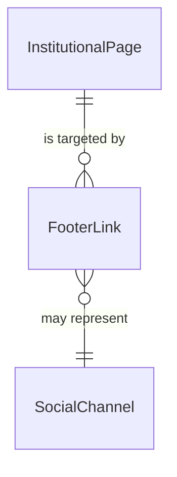
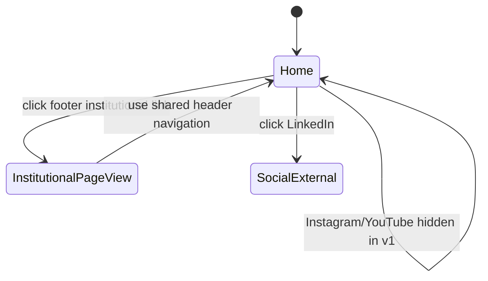

# Data Model: Páginas Institucionais do Rodapé

**Date**: 2026-08-07
**Feature**: specs/011-footer-legal-pages

## Entities

### 1. InstitutionalPage

Representa cada página institucional pública.

| Field | Type | Required | Description |
|---|---|---|---|
| `slug` | `string` | Yes | Identificador de rota (`sobre`, `politica-de-privacidade`, `termos`) |
| `title` | `string` | Yes | Título principal da página |
| `contentSections` | `array` | Yes | Seções de conteúdo textual institucional |
| `isPublished` | `boolean` | Yes | Indica se a página está visível ao público |
| `updatedAt` | `string` (ISO-8601) | Yes | Data de atualização de conteúdo |

**Validation Rules**:
- `slug` deve ser único por página.
- `title` não pode ser vazio.
- `contentSections` deve ter ao menos 1 seção.
- `isPublished` deve ser `true` para páginas acessíveis via rodapé.

**State Transitions**:
- `draft` -> `published` (quando conteúdo mínimo é aprovado)
- `published` -> `published` (atualizações de revisão)

---

### 2. FooterLink

Representa itens navegáveis do rodapé.

| Field | Type | Required | Description |
|---|---|---|---|
| `label` | `string` | Yes | Texto exibido no rodapé |
| `href` | `string` | Yes | Destino de navegação |
| `group` | `enum` | Yes | `institutional` ou `social` |
| `isVisible` | `boolean` | Yes | Controle de exibição |
| `order` | `number` | Yes | Ordem de apresentação no bloco |

**Validation Rules**:
- `href` deve ser rota interna válida para links institucionais.
- `label` deve ser único dentro do mesmo `group`.
- `order` deve ser inteiro positivo.

---

### 3. SocialChannel

Representa canais sociais da InterasisAI exibidos no rodapé.

| Field | Type | Required | Description |
|---|---|---|---|
| `name` | `enum` | Yes | `linkedin`, `instagram`, `youtube` |
| `url` | `string` | Yes | URL do canal |
| `isVisible` | `boolean` | Yes | Estado de visibilidade do canal |

**Current v1 State**:
- `linkedin`: `isVisible = true`, URL oficial definida.
- `instagram`: `isVisible = false`.
- `youtube`: `isVisible = false`.

**Validation Rules**:
- Quando `isVisible = true`, `url` deve ser não vazia e válida.
- `name` deve ser único.

---

## Relationships

## Navigation Flow States

