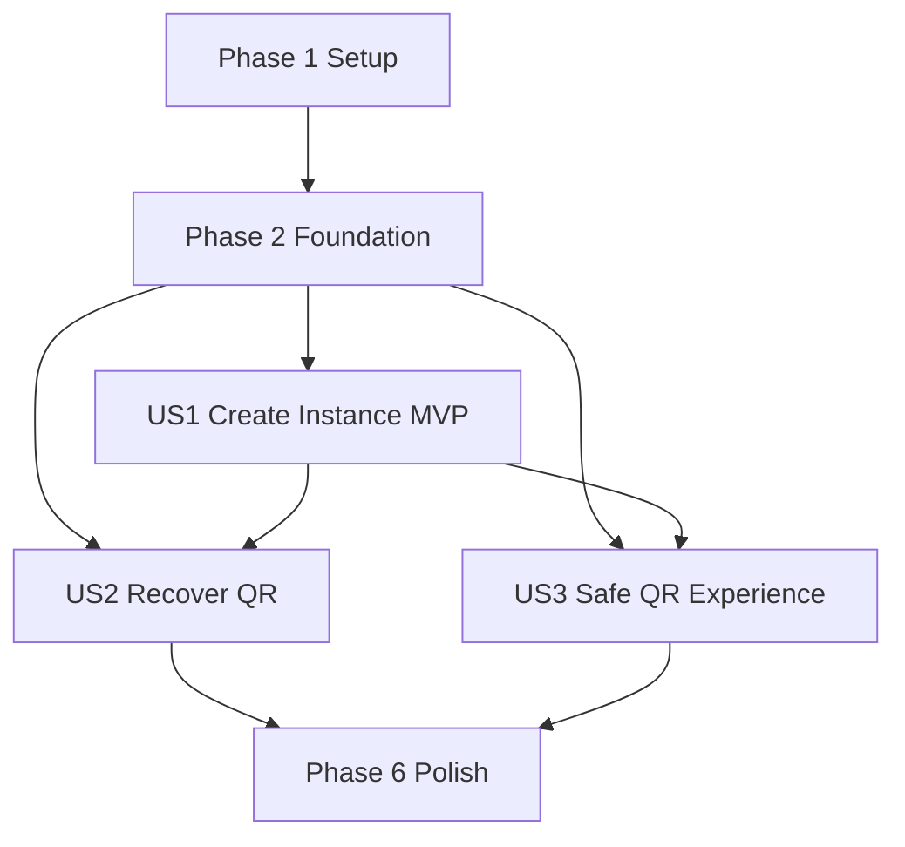

# Tasks: Conexão de Instâncias WhatsApp

**Input**: Design documents from `/specs/012-whatsapp-instance-connection/`
**Prerequisites**: `plan.md`, `spec.md`, `research.md`, `data-model.md`, `contracts/`, `quickstart.md`

**Tests**: Testes são obrigatórios pela constituição do projeto. Em cada história, escreva e execute os testes indicados antes da implementação correspondente e confirme que falham pelo motivo esperado.

**Organization**: As tarefas estão agrupadas por história de usuário para permitir implementação e validação independentes.

## Format: `[ID] [P?] [Story] Description`

- **[P]**: Pode ser executada em paralelo porque altera arquivos diferentes e não depende de tarefa incompleta.
- **[Story]**: História atendida pela tarefa (`US1`, `US2`, `US3`).
- Todos os caminhos são relativos à raiz do repositório.

## Phase 1: Setup (Shared Infrastructure)

**Purpose**: Adicionar dependências e documentar configuração compartilhada.

- [X] T001 Install `zod`, `react-hook-form`, and `@hookform/resolvers` and update package.json and package-lock.json
- [X] T002 [P] Create sanitized environment template with `NEXT_PUBLIC_PYTHON_BACKEND_URL`, `ADM_USER`, `ADM_PWD`, and `ADMIN_SESSION_SECRET` in .env.example

---

## Phase 2: Foundational (Blocking Prerequisites)

**Purpose**: Implementar autenticação server-side, schemas e estrutura administrativa exigidos por todas as histórias.

**⚠️ CRITICAL**: Nenhuma história de usuário deve iniciar antes desta fase estar concluída.

### Tests for Foundational Infrastructure

- [X] T003 [P] Write failing HMAC token, expiry, tampering, and timing-safe verification tests in src/lib/adminSession.test.ts
- [X] T004 [P] Write failing POST/DELETE session contract tests for 204, 400, 401, 503, and cookie flags in src/app/api/admin/session/route.test.ts
- [X] T005 [P] Write failing trim/required-field schema tests for admin login and WhatsApp instance inputs in src/lib/whatsappSchemas.test.ts
- [X] T006 [P] Write failing loading, generic-error, and successful-refresh hook tests in src/hooks/useAdminAuth.test.ts
- [X] T007 [P] Write failing accessible login interaction tests in src/components/admin/AdminLoginForm.test.tsx

### Implementation for Foundational Infrastructure

- [X] T008 Implement shared Zod login and WhatsApp form schemas with inferred TypeScript types in src/lib/whatsappSchemas.ts
- [X] T009 Implement short-lived HMAC-SHA256 admin session creation and timing-safe validation using server-only environment variables in src/lib/adminSession.ts
- [X] T010 Implement POST login and DELETE logout handlers with `admin_session` HttpOnly/SameSite=Strict/Path=/admin cookie behavior in src/app/api/admin/session/route.ts
- [X] T011 Implement login/logout request state and router refresh behavior without exposing credentials in src/hooks/useAdminAuth.ts
- [X] T012 Implement React Hook Form login UI with accessible errors and loading state in src/components/admin/AdminLoginForm.tsx
- [X] T013 [P] Extract the authenticated ingestion dashboard and WhatsApp navigation entry into src/components/admin/AdminDashboard.tsx
- [X] T014 Refactor src/app/admin/page.tsx into a server wrapper with route metadata, cookie validation, login fallback, and authenticated AdminDashboard rendering

**Checkpoint**: A sessão administrativa protege o conteúdo e nenhuma credencial é lida de `NEXT_PUBLIC_ADM_USER` ou `NEXT_PUBLIC_ADM_PWD`.

---

## Phase 3: User Story 1 - Cadastrar instância e conectar WhatsApp (Priority: P1) 🎯 MVP

**Goal**: Permitir que um administrador autenticado cadastre uma instância para um tenant e veja imediatamente o QR Code retornado.

**Independent Test**: Autenticar, abrir `/admin/whatsapp`, informar tenant e nome inéditos, criar a instância e confirmar navegação para a página dedicada com o QR PNG e a instância corretos.

### Tests for User Story 1

- [X] T015 [P] [US1] Write failing POST contract tests for request body, 201 mapping, malformed PNG, API errors, and network failure in src/services/pythonBackend.test.ts
- [X] T016 [P] [US1] Write failing provider/hook tests for create loading, duplicate blocking, matching response state, error preservation, and stale-response rejection in src/hooks/useWhatsAppConnection.test.ts
- [X] T017 [P] [US1] Write failing accessible create form tests for required fields, loading disablement, preserved values, and successful navigation in src/components/admin/WhatsAppInstanceForm.test.tsx
- [X] T018 [P] [US1] Write failing QR success rendering tests for instance identity, validated PNG, Next Image attributes, return action, and no QR leakage in src/components/admin/WhatsAppQrCodeView.test.tsx

### Implementation for User Story 1

- [X] T019 [US1] Add typed create-instance payloads, API responses, discriminated results, and shared PNG data URL guard in src/services/pythonBackend.types.ts
- [X] T020 [US1] Implement base-URL-only configuration and `POST /api/v1/whatsapp/instances` handling without Evolution API calls or QR logging in src/services/pythonBackend.ts
- [X] T021 [US1] Export the create-instance service and WhatsApp contract types from src/services/index.ts
- [X] T022 [US1] Implement granular in-memory provider and create flow with AbortController/request-id stale protection in src/context/WhatsAppConnectionContext.tsx and src/hooks/useWhatsAppConnection.ts
- [X] T023 [US1] Implement React Hook Form create UI, accessible feedback, immediate loading, duplicate-action blocking, and encoded QR-route navigation in src/components/admin/WhatsAppInstanceForm.tsx
- [X] T024 [US1] Implement protected WhatsApp provider layout with route metadata support in src/app/admin/whatsapp/layout.tsx and create-module server page in src/app/admin/whatsapp/page.tsx
- [X] T025 [US1] Implement stable `next/image` PNG QR success view with instance label and return action in src/components/admin/WhatsAppQrCodeView.tsx
- [X] T026 [US1] Implement protected QR server page that decodes the route instance and consumes only a matching in-memory QR in src/app/admin/whatsapp/[instanceName]/qrcode/page.tsx

**Checkpoint**: US1 funciona como MVP completo sem o fluxo de recuperação; criação inválida permanece editável e QR válido nunca aparece em URL, storage ou logs.

---

## Phase 4: User Story 2 - Rever ou recuperar QR Code (Priority: P2)

**Goal**: Recuperar o QR Code atual de uma instância existente sem criar uma nova instância.

**Independent Test**: Informar apenas uma instância existente, acionar “Reconectar / Ver QR Code” e confirmar GET, loading e exibição do QR atualizado; atualizar a rota de QR e confirmar nova consulta sem POST.

### Tests for User Story 2

- [X] T027 [US2] Write failing GET contract tests for encoded instance path, 200 mapping, malformed PNG, 404/409/500, and network failure in src/services/pythonBackend.test.ts
- [X] T028 [US2] Extend hook tests with reconnect loading, automatic refresh recovery, retry, matching-instance replacement, field preservation, and no create call in src/hooks/useWhatsAppConnection.test.ts
- [X] T029 [US2] Extend form tests with instance-only reconnect validation, disabled concurrent actions, errors, and encoded navigation in src/components/admin/WhatsAppInstanceForm.test.tsx

### Implementation for User Story 2

- [X] T030 [US2] Add typed QR-recovery responses/results and implement `GET /api/v1/whatsapp/instances/{instance_name}/qrcode` with encoded path and safe errors in src/services/pythonBackend.types.ts and src/services/pythonBackend.ts
- [X] T031 [US2] Export QR-recovery contracts and service from src/services/index.ts and implement reconnect/retry state transitions in src/context/WhatsAppConnectionContext.tsx and src/hooks/useWhatsAppConnection.ts
- [X] T032 [US2] Add “Reconectar / Ver QR Code” to src/components/admin/WhatsAppInstanceForm.tsx and automatic GET fallback for direct access/refresh in src/app/admin/whatsapp/[instanceName]/qrcode/page.tsx

**Checkpoint**: US2 recupera uma instância conhecida por GET, inclusive após refresh, sem executar cadastro e sem substituir QR por resposta antiga ou de outra instância.

---

## Phase 5: User Story 3 - Escanear QR Code com segurança operacional (Priority: P3)

**Goal**: Tornar loading, sucesso e falha inequívocos e manter o QR escaneável, identificado e responsivo.

**Independent Test**: Abrir a rota em loading, sucesso e erro; confirmar que não há imagem anterior/quebrada, que retry/retorno funcionam e que QR, identificação e ações não se sobrepõem em mobile e desktop.

### Tests for User Story 3

- [X] T033 [US3] Extend QR view interaction tests for loading frame, aria-live status, malformed/image-error fallback, retry, numbered scan instructions, “Concluído / Fechar”, keyboard access, and responsive class contract in src/components/admin/WhatsAppQrCodeView.test.tsx

### Implementation for User Story 3

- [X] T034 [US3] Complete responsive loading/error/success states, numbered WhatsApp scan instructions, image-error fallback, accessible retry, fixed dimensions, and non-overlapping actions in src/components/admin/WhatsAppQrCodeView.tsx
- [X] T035 [US3] Wire route-level retry, reset, and “Concluído / Fechar” behavior so QR content is cleared before a new request or return to `/admin/whatsapp` in src/app/admin/whatsapp/[instanceName]/qrcode/page.tsx and src/hooks/useWhatsAppConnection.ts

**Checkpoint**: Todos os estados são acessíveis e visualmente estáveis; um QR inválido, antigo ou de outra instância nunca é renderizado.

---

## Phase 6: Polish & Cross-Cutting Concerns

**Purpose**: Encerrar segurança, regressão e validação operacional de todas as histórias.

- [X] T036 Remove client credential reads, verify QR/credentials are absent from logs and storage, and document the migration from `NEXT_PUBLIC_ADM_*` to server-only variables in .env.example and specs/012-whatsapp-instance-connection/quickstart.md
- [X] T037 Run focused and full Jest suites, ESLint, production build, and every manual scenario in specs/012-whatsapp-instance-connection/quickstart.md; record any environment-only limitation in specs/012-whatsapp-instance-connection/quickstart.md

---

## Dependencies & Execution Order

### Phase Dependencies

- **Phase 1 - Setup**: Sem dependências; T001 e T002 podem ocorrer em paralelo.
- **Phase 2 - Foundational**: Depende de T001; bloqueia todas as histórias. T003-T007 podem ser escritos em paralelo e devem falhar antes de T008-T014.
- **Phase 3 - US1**: Depende da fundação. Entrega o MVP de cadastro e QR inicial.
- **Phase 4 - US2**: Depende da fundação e reutiliza os tipos/provider visados por US1; pode ser desenvolvida em paralelo em uma cópia isolada, mas a integração no mesmo arquivo deve ocorrer após T026 para evitar conflito.
- **Phase 5 - US3**: Depende da fundação e do componente/rota de QR de US1; pode começar pelos testes após o contrato visual de T018.
- **Phase 6 - Polish**: Depende das histórias selecionadas para entrega.

### User Story Dependencies



- **US1 (P1)**: Inicia após Phase 2 e não depende funcionalmente de US2/US3.
- **US2 (P2)**: É testável por GET sem novo cadastro, mas integra no serviço/provider/form criados por US1.
- **US3 (P3)**: É testável com estados mockados, mas aprimora o componente e a rota introduzidos por US1.

### Within Each User Story

1. Escrever testes e confirmar falha esperada.
2. Definir/estender tipos e schemas.
3. Implementar serviço HTTP.
4. Implementar hook/context.
5. Implementar componentes e páginas.
6. Executar testes focados e validar o checkpoint da história.

## Parallel Opportunities

- T001 e T002 podem ser executadas em paralelo.
- T003-T007 podem ser escritas em paralelo após instalar as dependências.
- T013 pode avançar em paralelo com T008-T012 porque extrai a dashboard existente para outro arquivo.
- T015-T018 podem ser escritas em paralelo após a fundação.
- Depois da fundação, equipes separadas podem preparar testes de US2 e US3 enquanto US1 implementa os arquivos-base; a integração em arquivos compartilhados segue a ordem das fases.
- Validações manuais responsivas podem ocorrer em paralelo com a revisão de segurança de T036.

## Parallel Example: User Story 1

```text
Task T015: Testar contrato POST em src/services/pythonBackend.test.ts
Task T016: Testar estado de criação em src/hooks/useWhatsAppConnection.test.ts
Task T017: Testar formulário em src/components/admin/WhatsAppInstanceForm.test.tsx
Task T018: Testar QR de sucesso em src/components/admin/WhatsAppQrCodeView.test.tsx
```

## Parallel Example: User Story 2

```text
Task T027: Preparar testes GET em src/services/pythonBackend.test.ts
Task T029: Preparar testes de reconexão em src/components/admin/WhatsAppInstanceForm.test.tsx
```

T028 não deve ser alterada simultaneamente com T016/T022 porque compartilha `src/hooks/useWhatsAppConnection.test.ts`.

## Parallel Example: User Story 3

```text
Task T033: Testar estados visuais em src/components/admin/WhatsAppQrCodeView.test.tsx
Task T036: Revisar configuração e documentação em .env.example e specs/012-whatsapp-instance-connection/quickstart.md
```

## Implementation Strategy

### MVP First

1. Concluir Setup e Foundation.
2. Implementar T015-T026 da US1.
3. Executar testes focados de serviço, hook, formulário e QR.
4. Validar o checkpoint da US1 e demonstrar cadastro → QR sem depender de reconexão.

### Incremental Delivery

1. **Foundation**: autenticação server-side e validação compartilhada.
2. **US1**: cadastro e QR inicial, entregando o MVP.
3. **US2**: recuperação por nome e resiliência a refresh.
4. **US3**: estados operacionais, acessibilidade e responsividade completos.
5. **Polish**: segurança, regressão, build e quickstart integral.

### Parallel Team Strategy

1. Equipe completa Setup/Foundation e estabiliza contratos.
2. Pessoa A implementa serviço e provider de US1.
3. Pessoa B prepara componentes/testes de formulário e QR em arquivos separados.
4. Pessoa C prepara testes GET e cenários visuais de US2/US3 sem editar simultaneamente arquivos compartilhados.
5. Integrações em `pythonBackend.ts`, `useWhatsAppConnection.ts`, formulário e rota QR seguem a ordem US1 → US2 → US3.

## Notes

- `[P]` indica arquivos independentes e ausência de dependência em tarefa incompleta.
- `[US1]`, `[US2]`, `[US3]` garantem rastreabilidade com a especificação.
- Nunca registrar `qrcode_base64`, senha, token ou cookie.
- Nunca persistir QR em URL, localStorage ou sessionStorage.
- O frontend chama somente `NEXT_PUBLIC_PYTHON_BACKEND_URL`; Evolution API permanece fora deste repositório.
- Interromper em cada checkpoint para validar a história de forma independente.
