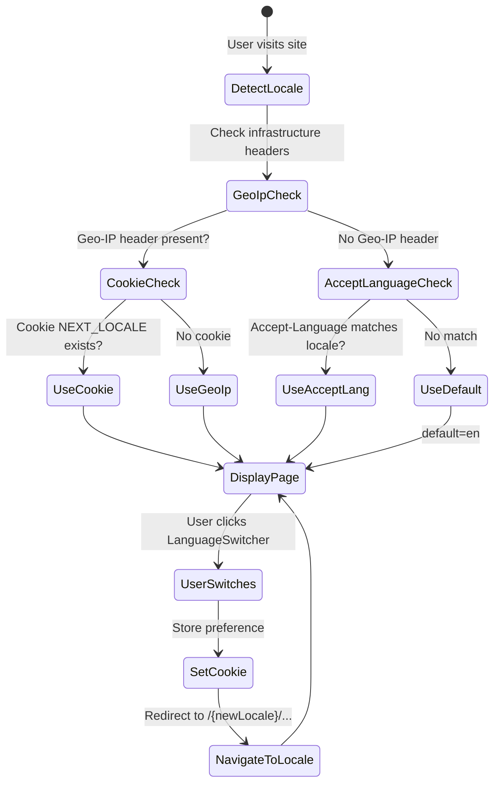
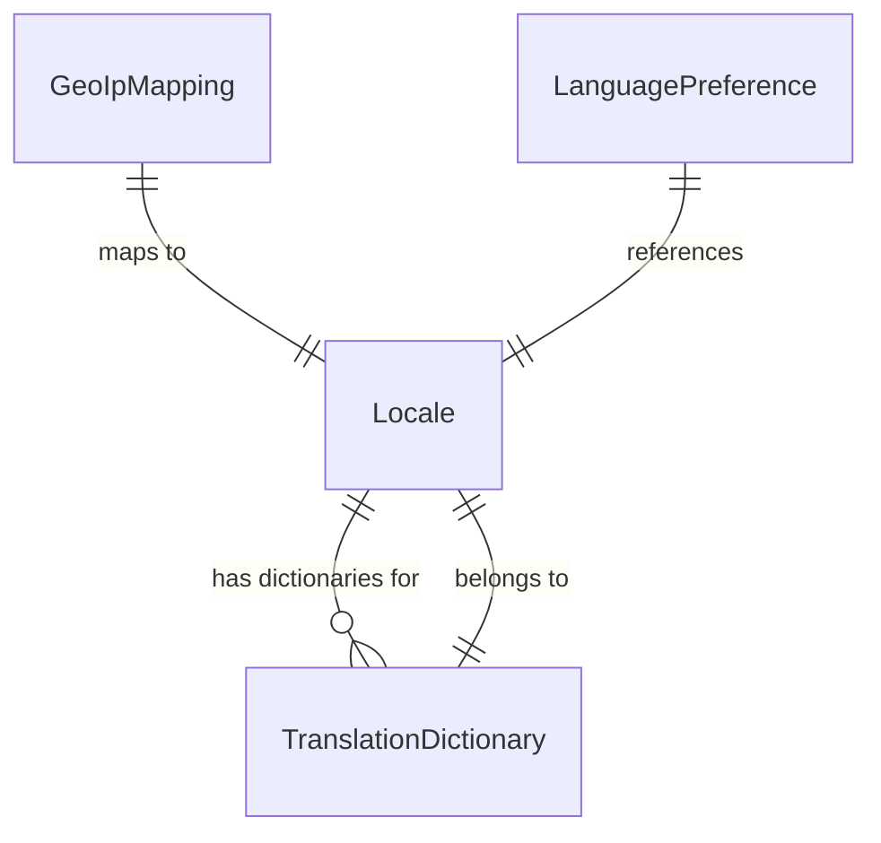

# Data Model: Internacionalização com Seletor de Idiomas

**Feature**: 014-i18n-language-switcher  
**Date**: 2026-08-10  
**Purpose**: Modelagem de dados para o sistema de i18n (entidades, relações, validações)

---

## Entity Catalog

### 1. Locale

Representa um idioma suportado pelo sistema.

| Field | Type | Description | Validation |
|-------|------|-------------|------------|
| `code` | `string` | Código BCP 47 do locale | Required; enum: `"pt-BR"`, `"en"`, `"es"` |
| `flag` | `string` | Emoji da bandeira representativa | Required; non-empty |
| `nativeName` | `string` | Nome do idioma na própria língua | Required; non-empty |
| `dir` | `"ltr" \| "rtl"` | Direção do texto | Required; sempre `"ltr"` para os locales atuais |

**Instances** (constantes em `src/i18n/config.ts`):

```typescript
const locales = [
  { code: "pt-BR", flag: "🇧🇷", nativeName: "Português", dir: "ltr" },
  { code: "en",    flag: "🇺🇸", nativeName: "English",   dir: "ltr" },
  { code: "es",    flag: "🇪🇸", nativeName: "Español",   dir: "ltr" },
] as const;
```

---

### 2. LanguagePreference

Registro da escolha de idioma do visitante, persistido no navegador.

| Field | Type | Description |
|-------|------|-------------|
| `locale` | `LocaleCode` | Código do locale selecionado |
| `timestamp` | `number` (Unix ms) | Momento da última alteração |

**Storage**: Cookie HTTP-Only `NEXT_LOCALE` (gerenciado pelo `next-intl` middleware).  
**Lifecycle**: Persiste entre sessões de navegador (conforme configuração `maxAge` do cookie).  
**Precedence**: Cookie > Geo-IP detection > Accept-Language header > `en` (default).

---

### 3. TranslationDictionary

Conjunto de chaves textuais e seus valores correspondentes em cada idioma.

| Field | Type | Description |
|-------|------|-------------|
| `namespace` | `string` | Seção lógica (`common`, `home`, `about`, etc.) |
| `locale` | `LocaleCode` | Locale ao qual pertence |
| `entries` | `Record<string, string>` | Chave → valor traduzido |

**Organization**: Arquivos JSON em `src/i18n/locales/{locale}/{namespace}.json`.

**Namespaces**:

| Namespace | Description | Loaded By |
|-----------|-------------|-----------|
| `common` | Navegação, footer, CTAs, aria-labels, metadados compartilhados | Todas as páginas |
| `home` | Landing page: hero, serviços, portfólio, contato | `/[locale]/page.tsx` |
| `about` | Página Sobre | `/[locale]/sobre/page.tsx` |
| `privacy` | Política de Privacidade | `/[locale]/politica-de-privacidade/page.tsx` |
| `terms` | Termos de Uso | `/[locale]/termos/page.tsx` |
| `chat` | Chat widget UI strings | `ChatWidget.tsx`, `ChatStatus.tsx` |
| `admin` | Painel admin strings | Todos componentes em `src/components/admin/` |
| `validation` | Mensagens de erro de validação | Zod schemas (resolução no display) |

---

### 4. GeoIpMapping

Mapeamento de código de país ISO 3166-1 alpha-2 para locale suportado.

| Field | Type | Description |
|-------|------|-------------|
| `countryCode` | `string` (2 chars) | Código ISO do país |
| `locale` | `LocaleCode` | Locale correspondente |

**Mapping Table** (constante em middleware):

```typescript
const COUNTRY_TO_LOCALE: Record<string, LocaleCode> = {
  BR: "pt-BR",
  US: "en", GB: "en", CA: "en", AU: "en", NZ: "en", IE: "en",
  ES: "es", MX: "es", AR: "es", CO: "es", CL: "es", PE: "es",
  VE: "es", EC: "es", GT: "es", CU: "es", BO: "es", DO: "es",
  HN: "es", PY: "es", SV: "es", NI: "es", CR: "es", PA: "es",
  UY: "es", GQ: "es",
};
```

---

## State Transitions

### Language Selection Flow



### Cookie Precedence Logic

1. **Cookie `NEXT_LOCALE` exists AND valid** → Use cookie value (user preference)
2. **No cookie OR cookie invalid** → Check geo-IP headers
3. **Geo-IP header present AND maps to supported locale** → Use mapped locale
4. **No geo-IP OR unmapped country** → Check `Accept-Language` header
5. **Accept-Language matches supported locale** → Use matched locale
6. **No match** → Default to `en`

---

## Relationships



---

## Validation Rules

| Rule ID | Entity | Rule | Source |
|---------|--------|------|--------|
| V-001 | Locale | `code` must be one of `["pt-BR", "en", "es"]` | FR-001, FR-002 |
| V-002 | Locale | `flag` must be a non-empty string | FR-003 |
| V-003 | LanguagePreference | `locale` must be a valid `LocaleCode` | FR-005 |
| V-004 | TranslationDictionary | Every namespace must have entries for all 3 locales | SC-004 |
| V-005 | GeoIpMapping | Unknown country codes → `en` (fallback) | FR-002 |
